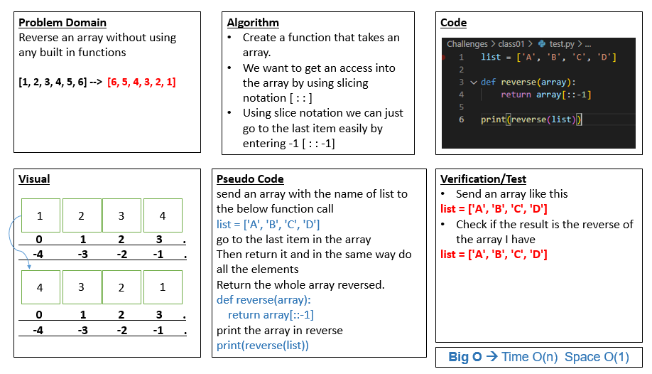

# Reverse an Array
>> Write a function called reverseArray which takes an array as an argument. 
Without utilizing any of the built-in methods available to your language, return an array with elements in reversed order.

## Whiteboard Process

## Approach & Efficiency

### What approach did i take? 
* Create a function that takes an array.
* We want to get an access into the array by using slicing notation [ : : ]
* Using slice notation we can just go to the last item easily by entering -1 [ : : -1]

### What is the Big O space/time for this approach? 
     Big O ==> O(1)
> **why? there is no loops in the code :)**