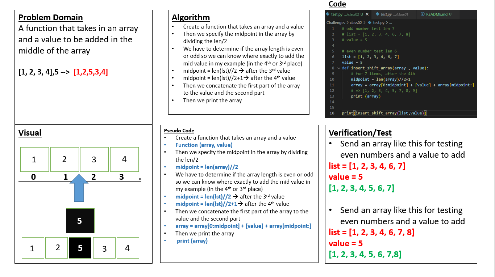

# Array-insert-shift
>> Write a function called insertShiftArray which takes in an array and a value to be added. Without utilizing any of the built-in methods available to your language, return an array with the new value added at the middle index.

## Whiteboard Process

## Approach & Efficiency

### What approach did i take? 
* Create a function that takes an array and a value
* Then we specify the midpoint in the array by 
* dividing the length by 2 `(len/2)`
* We have to determine if the array length is even or odd so we can know where exactly to add the mid value in my example (in the 4th or 3rd place)
`midpoint = len(lst)//2` --> after the 3rd value
`midpoint = len(lst)//2+1` -->  after the 4th value
* Then we concatenate the first part of the array to the value and the second part 
* Then we print the array 

### What is the Big O space/time for this approach? 

