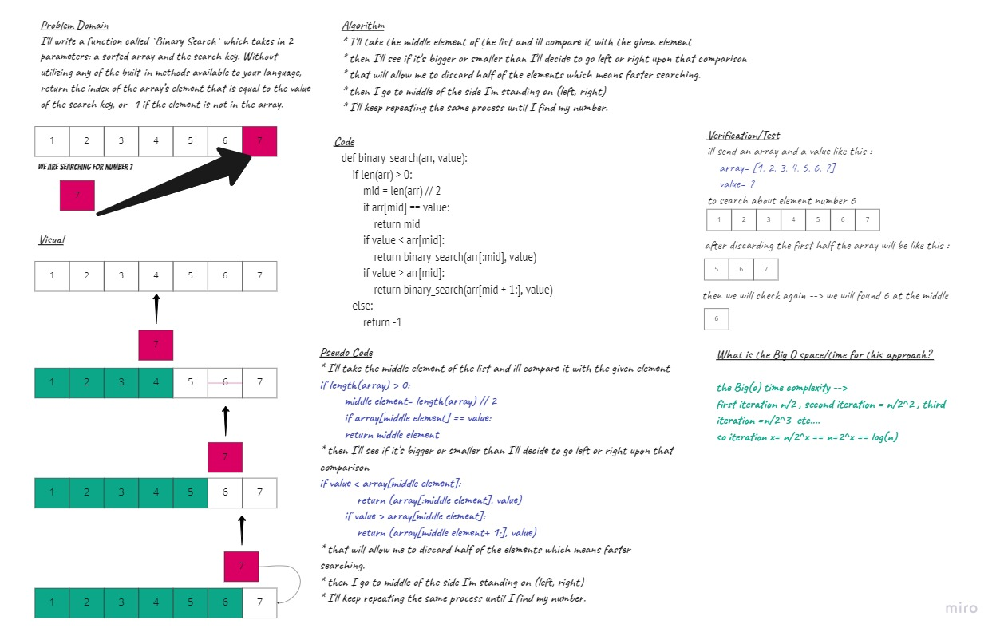

# Array-insert-shift
>> I'll write a function called `BinarySearch` which takes in 2 parameters: a sorted array and the search key. Without utilizing any of the built-in methods available to your language, return the index of the array’s element that is equal to the value of the search key, or -1 if the element is not in the array.

## Whiteboard Process

## Approach & Efficiency
we can use linear search and its gonna be O(n) but its not a good idea because what if we had a list 
of 1 million items and we are looking for the very last element what a bad case!!
so instead we use the binary search algorithm.

### What approach did i take? 
* i'll take the middle element of the list and ill compare it with the given element
* then i'll see if it's bigger or smaller than i'll decide to go left or right upon that comparison 
* that will allow me to discard half of the elements which means faster searching.
* then i go to middle of the side im standing on (left, right) 
* i'll keep repeating the same process until i find my number.

### What is the Big O space/time for this approach? 
the Big(o) time complexity --> 
first iteration n/2 , second iteration = n/2^2 , third iteration =n/2^3  etc.... 
so iteration x= n/2^x == n=2^x == log(n)