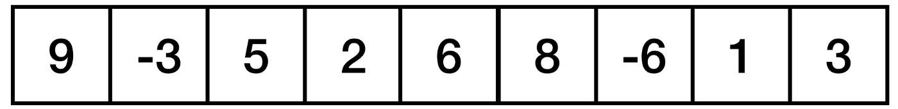
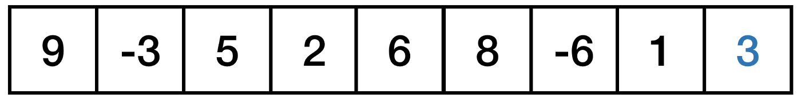
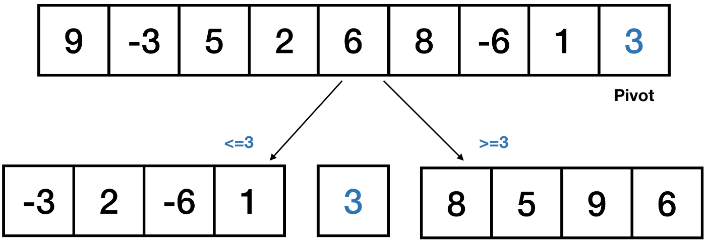
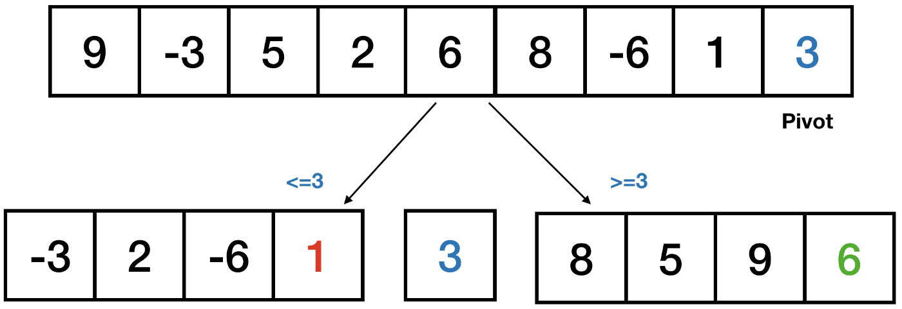
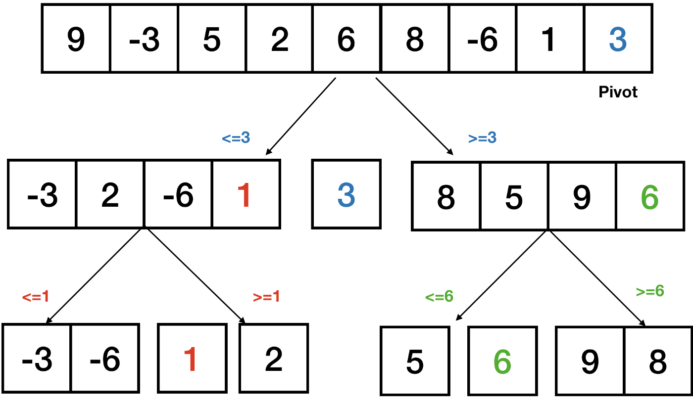
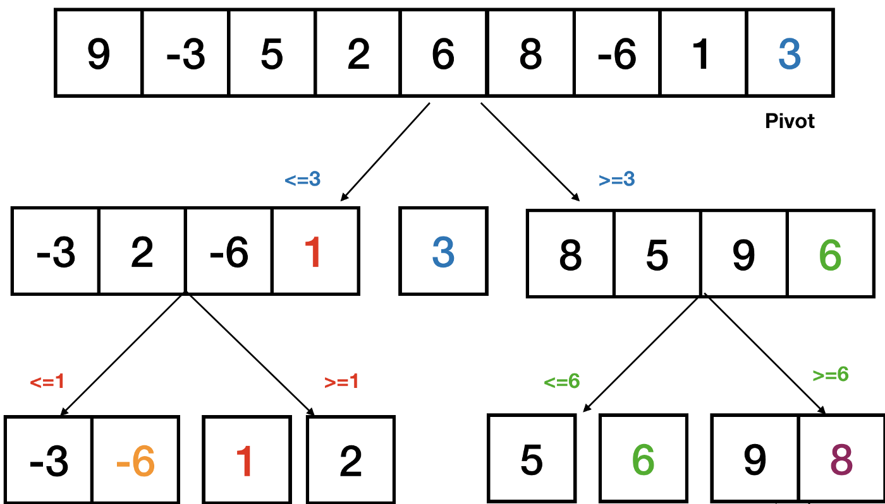
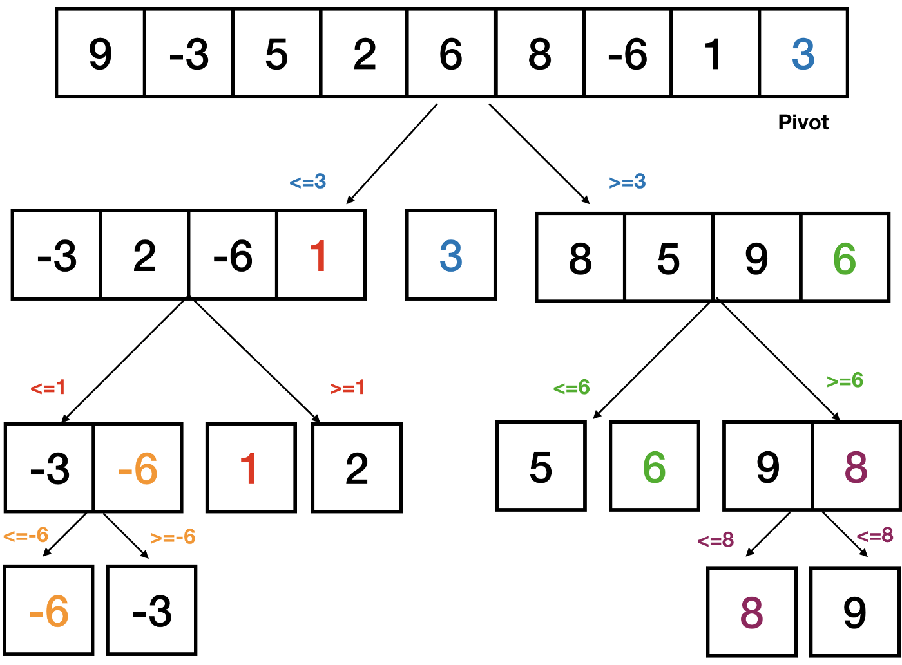
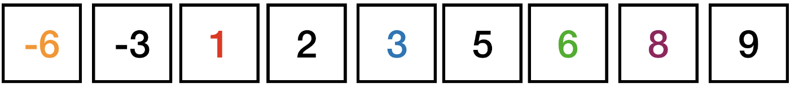

# Quick Sort

In python, Quick sort is defined as a sorting algorithm that follows the divide and conquers method to select the pivot element based on which the remaining array will be divided into two sub-arrays elements that are less than pivot will be in the left sub-array and elements which are greater than pivot will be in right sub-array and the process will repeat recursively until all sub-arrays got sorted without using auxiliary array’s or extra space is called Quick sort. 

Quick sort is an efficient and most used sorting algorithm that is better than similar algorithms if implemented well. 

It has an average-case time complexity of O(NlogN), and the worst-case time complexity is O(n^2).

## `Let’s get started!`

The process fundamental to the ‘QuickSort’ algorithm is the partition. The way partition works is by first selecting a pivot. Options for pivots include:

- First element
- Last element
- Random element
- Middle element

Upon selecting the pivot, we partition the elemQuick Sort based on the pivot value. Namely, foQuick Sort and pivot, we put all elements smaller than the pivot before the pivot and all elements greater than the pivot after it. 

----

## Algorithm & Visualization

To see this, let’s consider the following list:



Let’s select the last element, ‘3’, as our pivot:



Next, we create two sublists, the left list contains values less than the pivot and the right sublist contains values greater than the sublist:



We then find the pivot for the sublists and repeat the partition process. The pivot for the left sublist is 1 and the pivot for the right sublist is 6:



Next, we partition our sublists around their pivots:



And finally let’s select the pivots for the last set of sublists, -6 on the left and 8 on the right:



And let’s complete the final partition:



And we end up with the following sorted list:



----
## Pseudo Code

```
ALGORITHM QuickSort(arr, left, right)
    if left < right
        // Partition the array by setting the position of the pivot value
        DEFINE position <-- Partition(arr, left, right)
        // Sort the left
        QuickSort(arr, left, position - 1)
        // Sort the right
        QuickSort(arr, position + 1, right)

ALGORITHM Partition(arr, left, right)
    // set a pivot value as a point of reference
    DEFINE pivot <-- arr[right]
    // create a variable to track the largest index of numbers lower than the defined pivot
    DEFINE low <-- left - 1
    for i <- left to right do
        if arr[i] <= pivot
            low++
            Swap(arr, i, low)

     // place the value of the pivot location in the middle.
     // all numbers smaller than the pivot are on the left, larger on the right.
     Swap(arr, right, low + 1)
    // return the pivot index point
     return low + 1

ALGORITHM Swap(arr, i, low)
    DEFINE temp;
    temp <-- arr[i]
    arr[i] <-- arr[low]
    arr[low] <-- temp
```
----
## Code
Let’s see how to implement this algorithm in python. To start, let’s define our partition function. Our function will take a list, a ‘low’ variable and a ‘high’ variable. ‘Low’ is the index of the smaller element (where we’ll start in the list) and ‘high’ is the index of the pivot, which will be the last element. We initialize the index of the smallest element to be ‘low’ -1 and we define the pivot to be the value of the last element:

```
def partition(list,low,high):
    i = (low - 1)
    pivot = array[high]
```

Next, we will write a ‘for-loop’ iterating from ‘low’ to ‘high’:

```
def partition(list,low,high):
    i = (low - 1)
    pivot = array[high]
    for j in range(low, high):
```

Next, we check if the value at the current index within the ‘for-loop’ is less than or equal to the pivot. If the current value is less than the pivot, we increment the index of the smaller element:

```
def partition(input_list,low,high):
    i = (low - 1)
    pivot = input_list[high]
    for j in range(low, high):
        if input_list[j] <= pivot:
            i = i + 1
            input_list[i], input_list[j] =  input_list[j], input_list[i]
```

Otherwise, if the current value is greater than the pivot, we swap the greater value with the pivot. We also return the index:

```
def partition(input_list,low,high):
    i = (low - 1)
    pivot = input_list[high]
    for j in range(low, high):
        if input_list[j] <= pivot:
            i = i + 1
            input_list[i], input_list[j] =  input_list[j], input_list[i]
    input_list[i+1],input_list[high] = input_list[high],input_list[i+1]
    return (i+1)
```

Next, let’s define our ‘quickSort’ function. We first check if the value for ‘low’ is less than ‘high’ and if the condition is true we define the partitioning index:

```
def quickSort(input_list, low, high):
    if low < high:
        partition_index = partition(input_list,low,high)
```

We then recursively call ‘quickSort’ and to sort elements before the partition:

```
def quickSort(input_list, low, high):
    if low < high:
        partition_index = partition(input_list,low,high)
        quickSort(input_list, low, partition_index - 1)
```

and sort elements after the partition:

```
def quickSort(input_list, low, high):
    if low < high:
        partition_index = partition(input_list,low,high)
        quickSort(input_list, low, partition_index - 1)
        quickSort(input_list, partition_index + 1, high)
```
We can now test our ‘quickSort’ function. Let’s test it with the list we used in our original example:

```
input_l = [9, -3, 5, 2, 6, 8, -6, 1, 3]
```

Let’s define our ‘high’ variable which will be the length of the list:

```
list_length = len(input_l)
```

The ‘low’ variable will be 0, since lists are zero indexed in python. Let’s now call the ‘quickSort’ method with our list, our ‘low’ value, which is 0, and ‘list_length’ - 1:

```
quickSort(input_l, 0, list_length -1)
```

Now our array should be sorted. Let’s print our array:

```
print(input_l)
```

We see that our function successfully sorted our list. I’ll stop here but I encourage you to play around with the code yourself.

----

## CONCLUSIONS
Finally, it is all about a quick sort algorithm in python. So far, we have seen the definition of quick sort, the logic behind quick sort implementation with step-by-step explanation, and how quick sort can be implemented using  python methods with examples and corresponding outputs.

Thank you for reading!


