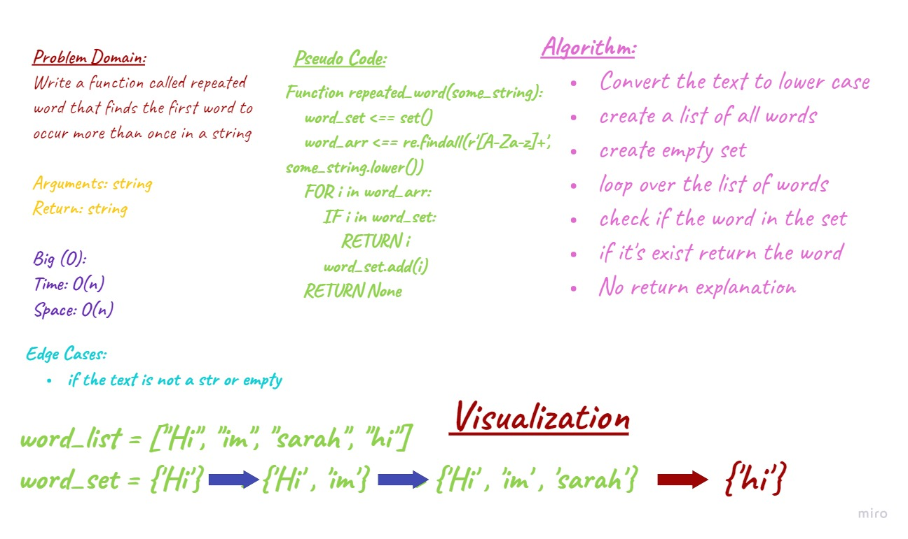

# Repeated Word
Author: Sarah Hudaib

## Challenge / API
Write a function called repeated word that finds the first word to occur more than once in a string.

- Arguments: string
- Return: string

## Approach & Efficiency
-	Function repeated_word(some_string)

> Big O(n) for the time & space complexity.

## Whiteboard Process

## Tests
[Link](./test_repeated_word.py) 

## Code
[Link](./repeated_word.py) 