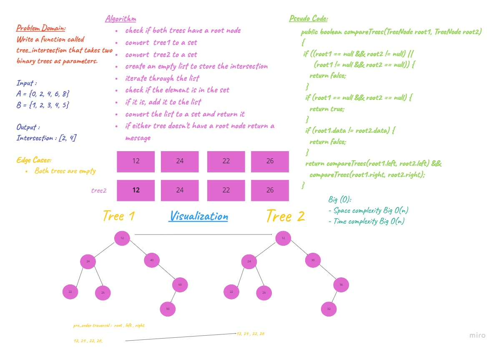

# Tree Intersection
Author: Sarah Hudaib

## Challenge
Write a function called tree_intersection that takes two binary trees as parameters.

Using your Hashmap implementation as a part of your algorithm, return a set of values found in both trees.

## Approach & Efficiency

- Function tree_intersection(): takes 2 trees as arguments and returns a list.

- Space complexity Big O(n)
- Time complexity Big O(n)

## Whiteboard Process

## Solution
- [Code](/Challenges/tree_intersection/tree_intersection.py)
- [Test](/Challenges/tree_intersection/test_tree_intersection.py)