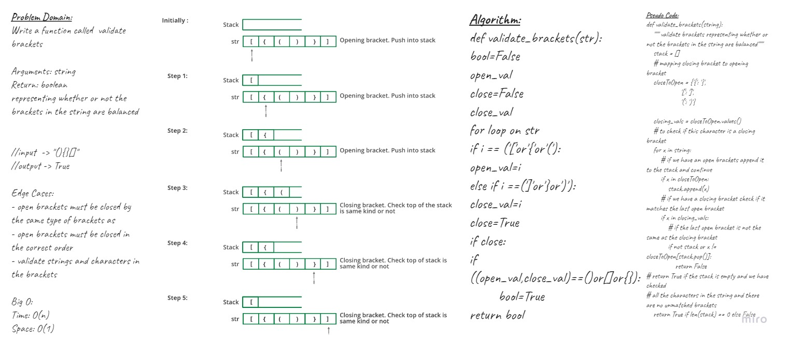

# Code Challenge / stack-queue-brackets
Write a function called validate brackets representing whether or not the brackets in the string are balanced
- `Arguments:` string
- `Return:` boolean

## API - Using Stacks to Solve this Challenge 
- first we start with the open brackets 
- we can add many as we want of the open brackets
- if we have a 4 open brackets, we must have 4 closing matching brackets
- then we remove them from our consideration (list)
- once we done we can return true for the brackets to be valid
- we always gonna be removing/pop from the top of the stack or the end of the list
- so that why i use stack 

## Edge cases
- open brackets must be closed by the same type of brackets as
- open brackets must be closed in the correct order
- validate strings and characters in the brackets

## Approach & Efficiency
stack-queue-brackets
- `Time Complexity`: O(n) 
- `Space Complexity`: O(1) 

## Whiteboard 

### stack-queue-brackets

