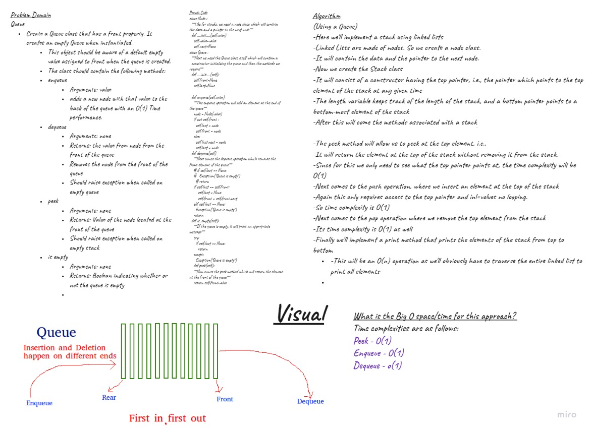
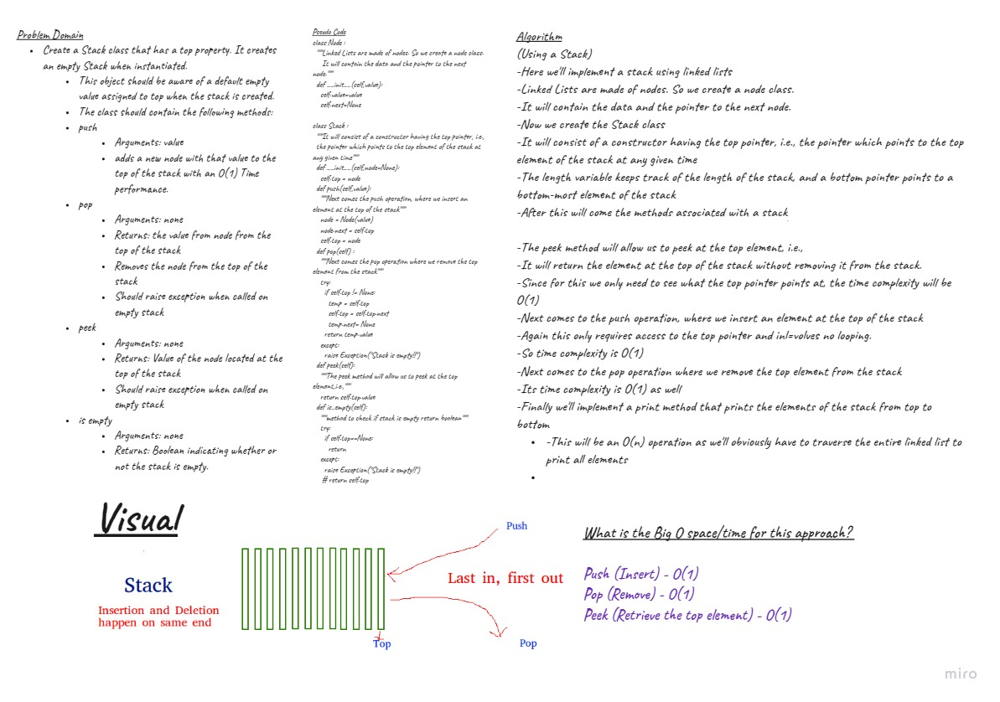
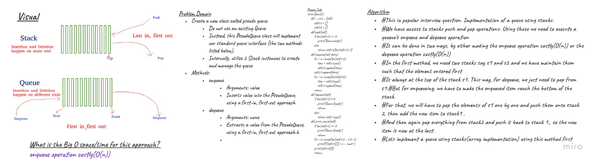

# Implementation: Stacks and Queues
`Stacks:` LIFO-FILO / browser history / stack overflow / undo button / redo button / create using arrays and linked lists

`Queues:` FIFO-LILO/ restaurant app / upper / printer / create using arrays and linked lists

## Challenge
Using a Linked List as the underlying data storage mechanism, implement both a Stack and a Queue

## API - Stacks
- `Push - Nodes` or items that are put into the stack are pushed
- `Pop - Nodes` or items that are removed from the stack are popped. When you attempt to pop an empty stack an exception will be raised.
- `Top -` This is the top of the stack.
- `Peek -` When you peek you will view the value of the top Node in the stack. When you attempt to peek an empty stack an exception will be raised.
- `IsEmpty -` returns true when stack is empty otherwise returns false.

## API - Queues
- `Enqueue - Nodes` or items that are added to the queue.
- `Dequeue - Nodes` or items that are removed from the queue. If called when the queue is empty an exception will be raised.
- `Front -` This is the front/first Node of the queue.
- `Rear -` This is the rear/last Node of the queue.
- `Peek - `When you peek you will view the value of the front Node in the queue. If called when the queue is empty an exception will be raised.
- `IsEmpty -` returns true when queue is empty otherwise returns false.

## Approach & Efficiency
Stacks
-	Lookup `O(n)`
-	Pop `O(1)`  remove the last item
-	Push `O(1)` add item 
-	Peek `O(1)`  what is the first item that’s going to come up

Queues
-	Lookup `O(n)`
-	enqueue `O(1)` add to the queue 
-	dequeue `O(1)` pop remove the first item  
-	Peek `O(1)` what is the first item that’s going to come up

## Whiteboard 
### Queues

### Stacks

### stack_queue_pseudo

