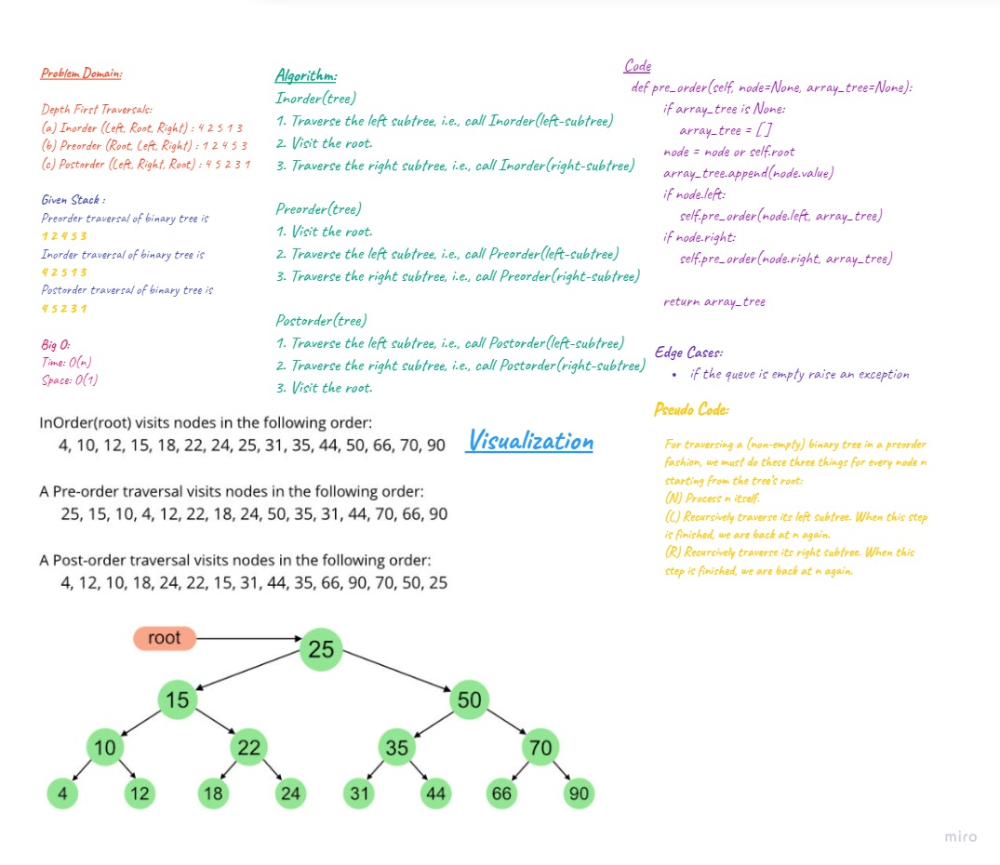
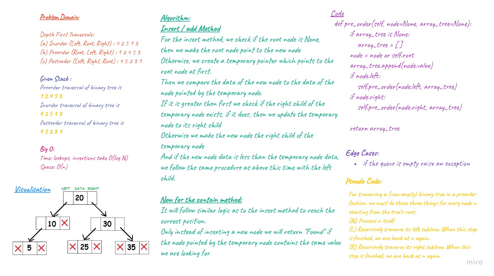

# Implementation: Binary Tree.

## Challenge
Create a Binary Tree class with methods pre_order, in_order and post_order Create a BinarySearchTree class with methods add(value) and contains()

## Approach & Efficiency
 - `method .pre_order` time big O(n), space big O(n) because we are adding all values of the elements in the tree to the array
-  `method .in_order` time big O(n), space big O(n) because we are adding all values of the elements in the tree to the array
 - `method .post_order` time big O(n), space big O(n) because we are adding all values of the elements in the tree to the array
 - `method .add()` time big O(h) -height of the tree, space O(1)
 - `contains .add()` time big O(h) -height of the tree, space O(1)
-  `breadth_first()` method Time and space Big O(n)

## API - Stacks
Stacks
-	_Node - Private class to create a node for the tree and also nodes for the Queue 
-	Queue - class to create a queue
-	BinaryTree - Class to create a binary tree
-	----.pre_order() - BinaryTree method to return an array of tree values in "pre-order" order
-	----.in_order() - BinaryTree method to return an array of tree values "in-order"
-	----.post_order() - BinaryTree method to return an array of tree values "post-order
-	----.breadth_first - a BinaryTree static method that takes a Binary Tree as its unique input, traversing the input tree using a Breadth-first approach, and returns a list of the values in the tree in the order they were encountered.
-	BinarySearchTree - Class to create a Binary Search Tree, inherits its properties from Binary Tree class
-	----.add(value) - BinarySearchTree method that accepts a value, and adds a new node with that value in the correct location in the binary search tree
-	----.contains (value) - BinarySearchTree method that accepts a value, and returns a Boolean indicating whether or not the value is in the tree at least once.

## Whiteboard 

### Binary tree

### Binary search tree

