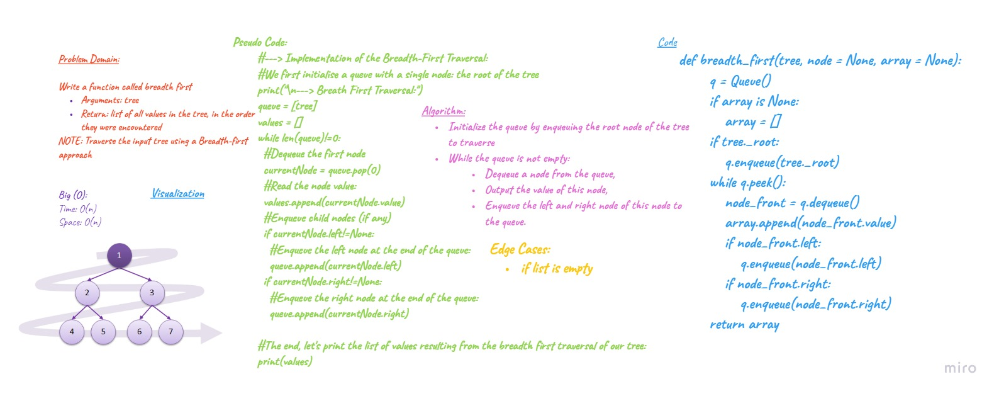

# tree-breadth-first: Binary Tree.

## Challenge
- Write a function called breadth first
- Arguments: tree
- Return: list of all values in the tree, in the order they were encountered

## Approach & Efficiency
 - `method .add()` time big O(log N)  -height of the tree, space O(n)
 - `breadth_first()` method Time and space Big O(n)

## API - using queue
-	Node - class to create a node for the tree and also nodes for the Queue 
-	Queue - class to create a queue
-	BinaryTree - Class to create a binary tree
-	BinarySearchTree - Class to create a Binary Search Tree, inherits its properties from Binary Tree class
-	.add(value) - BinarySearchTree method that accepts a value, and adds a new node with that value in the correct location in the binary search tree

## Whiteboard 

### Tree Breadth First 

