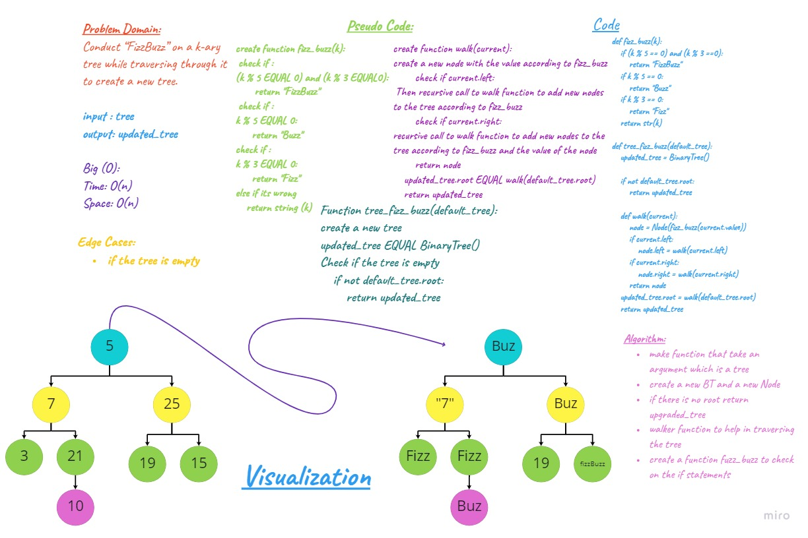

# FizzBuzz Tree
Author: Sarah Hudaib 

python version 3.10.4 & 3.9.5

May 8 2022 

## Challenge
Conduct `“FizzBuzz”` on a k-ary tree while traversing through it to create a new tree.

Set the values of each of the new nodes depending on the corresponding node value in the source tree.

Determine whether or not the value of each node is divisible by 3, 5 or both. Create a new tree with the same structure as the original, but the values modified as follows:

- If the value is divisible by 3, replace the value with “Fizz”
- If the value is divisible by 5, replace the value with “Buzz”
- If the value is divisible by 3 and 5, replace the value with “FizzBuzz”
- If the value is not divisible by 3 or 5, simply turn the number into a String.

- `Arguments:` k-ary tree
- `Return:` new k-ary tree

## Approach & Efficiency BT
`Function . fizz_buzz_tree`: 
- Time Big O(N) 
- Space Big O(N)

## Whiteboard 

## Solution Link: 
- [Link](./tree_fizz_buzz.py)

## Test Link: 
- [Link](./test_tree_fizz_buzz.py)

