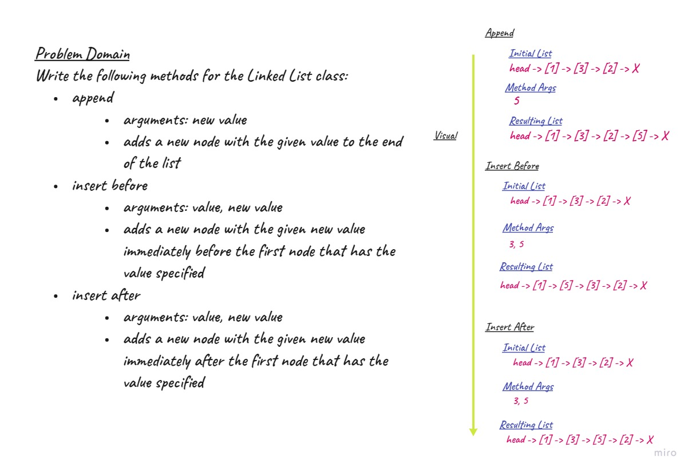
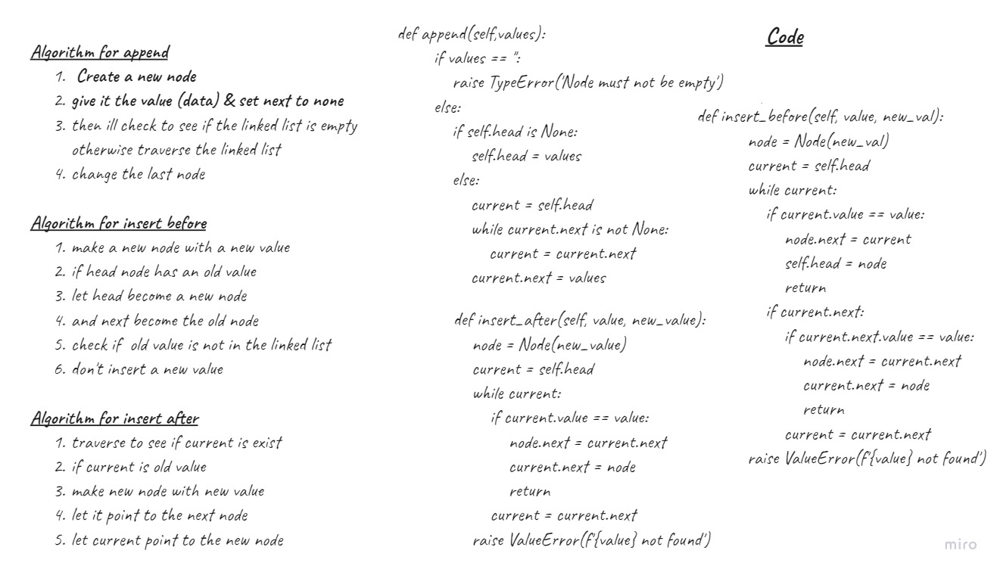

# Singly Linked List
- In a singly linked list, each node stores a reference to an object that is an element of the sequence, as well as a reference to the next node of the list. 
- It does'nt store any pointer or reference to the previous node. 

- To store a single linked list, only the reference or pointer to the first node in that list must be stored. 
- The last node in a single linked list points to nothing.

## Challenge
Create a Node class that has properties for the value stored in the Node, and a pointer to the next Node. Within your LinkedList class, include a head property. Upon instantiation, an empty Linked List should be created. Create methods in the LinkedList class that can insert, check for inclusion, and list nodes.

## API
- Create a `Node_class` that has properties for the value stored and a pointer to the next node.
- Create a `Linked List` that has include all the below properties:
- adds `includes()` method that checks if a value is included in a list and returns a boolean
- adds `insert()` method that can add a new node with given data
ll-insertions
- adds `append()` method that takes in a value and adds it to the end of the list
- adds `insert_before()` method that takes 2 arguments value and new value & adds a new node with the given new value immediately before the first node that has the value specified
- adds `insert_after()` method that takes 2 arguments value and new value and 
arguments: value, new value adds a new node with the given new value immediately after the first node that has the value specified
- adds `kth_from_end()` method that takes argument: a number, k, as a parameter. And return the node’s value that is k places from the tail of the linked list.

## Approach & Efficiency
- space & time are considered as a O(n)

## Whiteboard 

